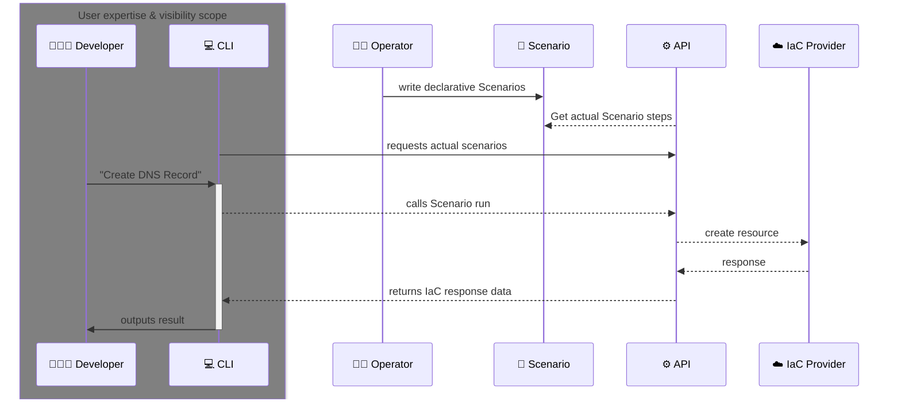
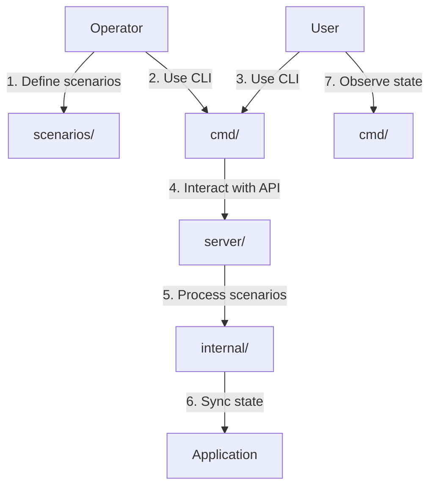

# MyCorp

## Overview

MyCorp is an open-source Internal Developer Platform (IDP).

It provides a unified interface for developers to manage internal resources.

Operators (platform engineers) define declarative scenarios in YAML format.

Those Scenarios are then executed by the CLI tool to manage resources like virtual machines, DNS records, and databases.



## Key Features

- **Platform-first approach**: Scenarios are dynamically fetched via API and CLI, ensuring users always interact with the latest interface specifications

- **Terminal-centric design**: The CLI tool offers powerful operation capabilities through structured commands, with features like help messages, strict call formatting, and autocompletion

- **Declarative workflow**: Operators define resource management scenarios using YAML, while Users execute these scenarios through the CLI

## Architecture



## Project Structure

```
├── cmd/             # Command-line interface for Users and API server
├── internal/        # Internal models, services, and utility packages
├── pkg/             # Publicly available packages (e.g. models)
└── scenarios/       # Scenario definitions for different resource types
```

## Contribution

[GitHub Issues & Milestones](https://github.com/agrrh/mycorp/milestones)
